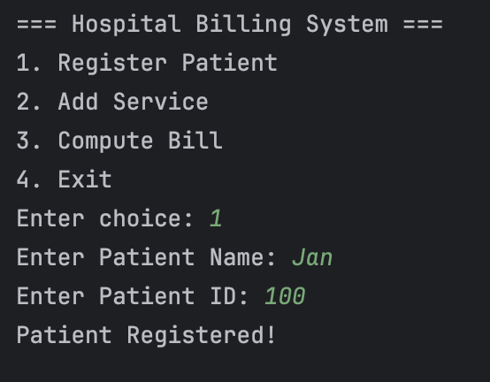
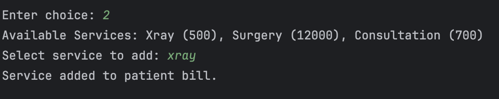
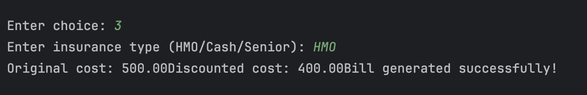
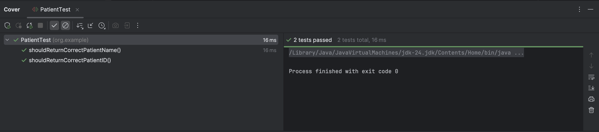
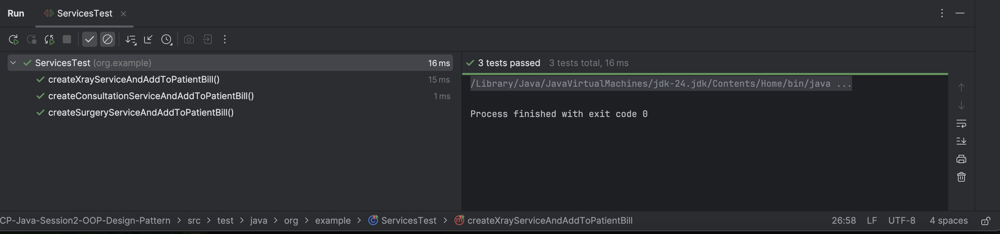
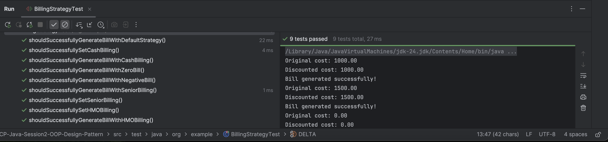

# FECP-Java-Session2-OOP-Design-Pattern

Group 8 <br/>
Members: <br/>
Jan Ryan Hidalgo <br/>
Eric Conrad Panga III <br/>
Jericho Paolo Dolendo <br/>

## Project Title: Lab 3: Java OOP Capstone Project
Our project is a simple hospital billing system where you can do the following:

1. Register Patient <br/>
    They will be asked of their name and patient ID.
    
2. Add Service <br/>
    The system will ask which services will the patient be acquiring. The available services are: Xray, Consultation, and Surgery.
   
3. Compute Bill <br/>
    The system will collate the total bill for the services acquired for the patient.
    

## Unit Testing for the program
The following test cases are considered for the system: <br/>
1. Checks the correct patient name and patient ID

2. Creates various service types (X-ray, Consultation, and Surgery) and add it to its bill

3. Checks if insurance type is set and correctly applied to the billing


## Project Directory
```
├── README.md
├── addService.png
├── billingStrategyTest.png
├── computeBill.png
├── patientTest.png
├── pom.xml
├── registerPatient.png
├── servicesTest.png
├── src
│   ├── main
│   │   └── java
│   │       └── org
│   │           └── example
│   │               ├── Main.java
│   │               ├── billing
│   │               │   ├── CashBilling.java
│   │               │   ├── HMOBilling.java
│   │               │   └── SeniorBilling.java
│   │               ├── model
│   │               │   ├── BillingStrategy.java
│   │               │   ├── Patient.java
│   │               │   └── Service.java
│   │               └── service
│   │                   ├── Consultation.java
│   │                   ├── ServiceFactory.java
│   │                   ├── Surgery.java
│   │                   └── Xray.java
│   └── test
│       └── java
│           └── org
│               └── example
│                   ├── BillingStrategyTest.java
│                   ├── PatientTest.java
│                   └── ServicesTest.java
└── unitTesting.png
```
